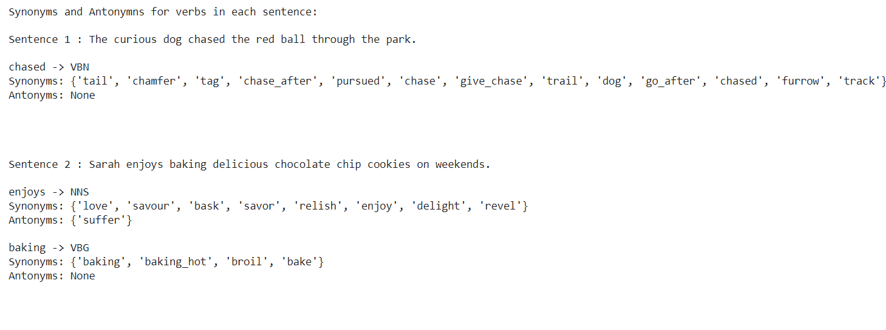

<H3>ENTER YOUR NAME: Manoj Guna Sundar Tella.</H3>
<H3>ENTER YOUR REGISTER NO: 212221240026.</H3>
<H3>EX. NO.6</H3>
<H3>DATE:</H3>
<H1 ALIGN =CENTER>Implementation of Semantic ANalysis</H1>
<H3>Aim: to perform Parts of speech identification and Synonym using Natural Language Processing (NLP) techniques. </H3> 
  
<h3>Algorithm:</h3>
Step 1: Import the nltk library. 
Step 2: Download the 'punkt', 'wordnet', and 'averaged_perceptron_tagger' resources. 
Step 3:Accept user input for the text. 
Step 4:Tokenize the input text into words using the word_tokenize function. 
Step 5:Iterate through each word in the tokenized text. 
•	Perform part-of-speech tagging on the tokenized words using nltk.pos_tag. 
•	Print each word along with its corresponding part-of-speech tag. 
•	For each verb , iterate through its synsets (sets of synonyms) using wordnet.synsets(word). 
•	Extract synonyms and antonyms using lemma.name() and lemma.antonyms()[0].name() respectively. 
•	Print the unique sets of synonyms and antonyms.
<H3>Program:</H3>
#importing packages
<code>
 ! pip install nltk
import nltk
from nltk.tokenize import word_tokenize
from nltk.corpus import wordnet
nltk.download('punkt')
nltk.download('averaged_perceptron_tagger')
nltk.download('wordnet')
</code>

<H3>Output</H3>

<H3>Result:</H3>
Thus ,the program to perform the Parts of Speech identification and Synonymis executed sucessfully.
